# KROK – Návrh databázy (Supabase / PostgreSQL)

> Tento dokument je pracovný návrh databázovej štruktúry pre nový systém KROK.
> Vychádza z analýzy súčasného FileMakeru (databaza.pdf + struktura.pdf) a reálneho bankového výpisu (camt.053 XML z FIO banky).

---

## 1. Vízia nového systému

```mermaid
graph TD
    subgraph "Verejná stránka (Next.js)"
        A[Domov / Projekty / 2% z dane]
        B[Registrácia nového darcu]
    end

    subgraph "Používateľská zóna (Darca)"
        C[Prihlásenie darcu]
        D[Môj profil & údaje]
        E[Moje dary – história a sumy]
        F[Čo podporujem – projekty]
    end

    subgraph "Admin zóna (Zamestnanci KROK)"
        G[Dashboard – štatistiky]
        H[Zoznam všetkých darcov]
        I[Detail darcu + všetky dary]
        J[Banka – Import XML výpisu]
        K[Párovanie platieb s darcami]
        L[Príjmy a Výdaje – prehľad]
        M[Správa projektov a grantov]
        N[Export / Reporty]
    end

    subgraph "Supabase (PostgreSQL)"
        DB[(Databáza)]
        AUTH[Auth – prihlasovanie]
        STORAGE[Storage – logo, prílohy]
    end

    A --> DB
    B --> AUTH
    C --> AUTH
    D --> DB
    E --> DB
    H --> DB
    J --> DB
    K --> DB
```



---

## 2. Čo bolo vo FileMakeri (Starý systém – analýza)

### Hlavné problémy starého riešenia
- **Fragmentácia po rokoch**: Samostatná tabuľka pre každý rok (dary_2020, dary_2021 … dary_2025) a ba dokonca v banke pre každý mesiac (Banka_2024, Banka_2024_3 …)
- **Vypočítavané polia uložené v tabuľke**: sumáre typu `sum_2020`, `sum_2021` namiesto dynamických dotazov
- **Globálne filtre**: Tabuľka `krok` s globálnymi poľami na dynamické filtrovanie cez vzťahy

### Tabuľky identifikované vo FileMakeri

| FM Tabuľka | Účel | → Nová tabuľka v Supabase |
|---|---|---|
| `donator` | Centrálna tabuľka darcov (PK: `ID_donator` UUID) | `donors` |
| `dary_2020` … `dary_2025` | Ročné tabuľky jednotlivých darov | `donations` (jedna tabuľka + stĺpec `date`) |
| `Banka_YYYY` / `Banka_YYYY_MM` | Importované bankové transakcie | `bank_transactions` |
| `Projekty` | Grantové projekty | `projects` |
| `Aktivity` / `Položky` | Aktivity a rozpočtové položky projektov | `activities` / `budget_items` |
| `Farnost` | Farnosti Žilinskej diecézy | `parishes` |
| `login` / `registracia` / `obnovahesla` | Autentifikácia | Supabase Auth (vstavané) |
| `krok` | Globálne filtrovacie polia | Nepotrebné (nahradíme SQL dotazmi) |
| `BarcodeGenerator` | Generovanie identifikátorov | Logika v Next.js |
| `Adresár` / `Registratúra` | Kontakty a dokumenty | `contacts` / integrované do iných tabuliek |

### Kľúčové polia z FM tabuľky `donator`
- `ID_donator` (UUID – primárny kľúč)
- `emailX` (email)
- `Farnost` (väzba na farnosť)
- `id_projekt` (väzba na projekt)
- `mesto`, `PSČ`, `číslo účtu`
- Audit polia: `Vytvoření Časové Razítko`, `Vytvořil`, `Změna Časové Razítko`, `Změnil`

---

## 3. Nová databázová štruktúra (Supabase)

### 3.1 `donors` – Darcovia

> Nahradí FileMaker tabuľku `donator`. Prepojená so Supabase Auth.

| Stĺpec | Typ | Popis |
|---|---|---|
| `id` | `UUID` PK | Primárny kľúč (= Supabase auth.users.id) |
| `legacy_id` | `TEXT` | Pôvodné `ID_donator` z FM pre migráciu |
| `variable_symbol` | `TEXT` UNIQUE | Variabilný symbol pre párovanie (napr. `11771254`) |
| `first_name` | `TEXT` | Meno |
| `last_name` | `TEXT` | Priezvisko |
| `title_before` | `TEXT` | Titul pred menom (Mgr., Ing., …) |
| `title_after` | `TEXT` | Titul za menom (PhD., …) |
| `email` | `TEXT` | E-mail (z auth) |
| `phone` | `TEXT` | Telefón |
| `street` | `TEXT` | Ulica + číslo |
| `city` | `TEXT` | Mesto |
| `postal_code` | `TEXT` | PSČ |
| `iban` | `TEXT` | IBAN účet darcu |
| `parish_id` | `UUID` FK | Väzba na farnosť |
| `donor_type` | `ENUM` | `individual` / `organization` / `parish` |
| `status` | `ENUM` | `active` / `inactive` / `suspended` |
| `notes` | `TEXT` | Interná poznámka (admin) |
| `registered_at` | `TIMESTAMPTZ` | Dátum registrácie |
| `created_at` | `TIMESTAMPTZ` | Vytvorenie záznamu |
| `updated_at` | `TIMESTAMPTZ` | Posledná úprava |

### 3.2 `donations` – Dary (konsolidované)

> Nahradí všetky ročné tabuľky `dary_2020` až `dary_2025+`. Jeden záznam = jeden dar.

| Stĺpec | Typ | Popis |
|---|---|---|
| `id` | `UUID` PK | Primárny kľúč |
| `donor_id` | `UUID` FK | Väzba na `donors` |
| `bank_transaction_id` | `UUID` FK | Väzba na spárovanú bankovú transakciu (nullable) |
| `project_id` | `UUID` FK | Na aký projekt bol dar určený (nullable) |
| `amount` | `DECIMAL(12,2)` | Suma daru v EUR |
| `donation_date` | `DATE` | Dátum daru |
| `year` | `INT` | Rok (pre rýchle filtrovanie / migráciu) |
| `month` | `INT` | Mesiac |
| `payment_method` | `ENUM` | `bank_transfer` / `postal_order` / `card_24pay` / `cash` |
| `matched` | `BOOLEAN` | Bolo spárované s bankou? |
| `matched_at` | `TIMESTAMPTZ` | Kedy bolo spárované |
| `matched_by` | `UUID` FK | Kto spároval (admin user) |
| `notes` | `TEXT` | Poznámka |
| `created_at` | `TIMESTAMPTZ` | Vytvorenie záznamu |

### 3.3 `bank_transactions` – Bankové transakcie

> Nahradí všetky fragmentované `Banka_YYYY` / `Banka_YYYY_MM` tabuľky. Importuje sa z **camt.053 XML** (FIO banka).

| Stĺpec | Typ | Popis |
|---|---|---|
| `id` | `UUID` PK | Primárny kľúč |
| `entry_ref` | `TEXT` UNIQUE | `NtryRef` z XML (napr. `27534947994`) |
| `message_id` | `TEXT` | `MsgId` z XML |
| `amount` | `DECIMAL(12,2)` | Suma |
| `currency` | `TEXT` | Mena (EUR) |
| `direction` | `ENUM` | `credit` (príjem) / `debit` (výdaj) |
| `booking_date` | `DATE` | Dátum zaúčtovania (`BookgDt`) |
| `value_date` | `DATE` | Dátum valuty (`ValDt`) |
| `counterparty_iban` | `TEXT` | IBAN protistrany (odosielateľ/prijímateľ) |
| `counterparty_bic` | `TEXT` | BIC banky protistrany |
| `counterparty_name` | `TEXT` | Meno protistrany (`AddtlTxInf`) |
| `variable_symbol` | `TEXT` | VS extrahovaný z `EndToEndId` |
| `specific_symbol` | `TEXT` | ŠS extrahovaný z `EndToEndId` |
| `constant_symbol` | `TEXT` | KS extrahovaný z `EndToEndId` |
| `remittance_info` | `TEXT` | Informácie pre príjemcu (`Ustrd`) |
| `bank_tx_code` | `TEXT` | Kód typu transakcie (`BkTxCd`) |
| `donor_id` | `UUID` FK | Spárovaný darca (nullable, vyplní sa po match) |
| `matched` | `BOOLEAN` | Indikátor, či bola transakcia spárovaná |
| `category` | `ENUM` | `donation` / `expense_salary` / `expense_tax` / `expense_supplier` / `expense_other` / `24pay_payout` / `unmatched` |
| `import_batch_id` | `UUID` FK | Väzba na import batch |
| `created_at` | `TIMESTAMPTZ` | Kedy bol záznam importovaný |

### 3.4 `bank_import_batches` – Importy bankových výpisov

> Evidencia každého importu XML súboru. Admin nahrá XML, systém ho rozparsuje.

| Stĺpec | Typ | Popis |
|---|---|---|
| `id` | `UUID` PK | |
| `filename` | `TEXT` | Názov nahratého súboru |
| `iban` | `TEXT` | IBAN účtu z výpisu |
| `period_from` | `DATE` | Začiatok obdobia (`FrDtTm`) |
| `period_to` | `DATE` | Koniec obdobia (`ToDtTm`) |
| `opening_balance` | `DECIMAL(12,2)` | Otvárajúci zostatok (`PRCD`) |
| `closing_balance` | `DECIMAL(12,2)` | Záverečný zostatok (`CLBD`) |
| `total_entries` | `INT` | Celkový počet transakcií |
| `total_credit` | `DECIMAL(12,2)` | Celkové príjmy |
| `total_debit` | `DECIMAL(12,2)` | Celkové výdaje |
| `imported_by` | `UUID` FK | Admin, ktorý importoval |
| `imported_at` | `TIMESTAMPTZ` | Dátum importu |

### 3.5 `projects` – Projekty a grantové výzvy

| Stĺpec | Typ | Popis |
|---|---|---|
| `id` | `UUID` PK | |
| `name` | `TEXT` | Názov projektu |
| `slug` | `TEXT` UNIQUE | URL-friendly identifikátor |
| `description` | `TEXT` | Popis projektu |
| `category` | `ENUM` | `charity` / `education` / `parish` / `evangelization` / `youth` / `liturgy` / `other` |
| `status` | `ENUM` | `active` / `completed` / `draft` |
| `target_amount` | `DECIMAL(12,2)` | Cieľová suma (nullable) |
| `start_date` | `DATE` | Začiatok |
| `end_date` | `DATE` | Koniec (nullable) |
| `image_url` | `TEXT` | URL obrázka v Supabase Storage |
| `visible_on_web` | `BOOLEAN` | Zobraziť na verejnom webe |
| `created_at` | `TIMESTAMPTZ` | |
| `updated_at` | `TIMESTAMPTZ` | |

### 3.6 `parishes` – Farnosti

| Stĺpec | Typ | Popis |
|---|---|---|
| `id` | `UUID` PK | |
| `name` | `TEXT` | Názov farnosti |
| `deanery` | `TEXT` | Dekanát |
| `city` | `TEXT` | Mesto/Obec |
| `postal_code` | `TEXT` | PSČ |

### 3.7 `admin_users` – Admin roly (nad Supabase Auth)

| Stĺpec | Typ | Popis |
|---|---|---|
| `id` | `UUID` PK | = auth.users.id |
| `role` | `ENUM` | `super_admin` / `admin` / `viewer` |
| `name` | `TEXT` | Meno admina |
| `created_at` | `TIMESTAMPTZ` | |

---

## 4. Logika párovania bankových transakcií

Na základe analýzy reálneho XML výpisu som identifikoval nasledovnú logiku:

### 4.1 Formát `EndToEndId` (variabilný/špecifický/konštantný symbol)

Z XML poľa `EndToEndId` sa dajú extrahovať platobné symboly. Príklady z reálnych dát:

```
?/VS11771392/SS/KS0308        → VS=11771392, SS=prázdny, KS=0308
?/VS0011770994/SS/KS           → VS=11770994
?/VS11771254/SS11771254/KS     → VS=11771254, SS=11771254
NOTPROVIDED                     → žiadne symboly
122581801                       → len číslo bez prefixov
?/VS202602/SS1398/KS0558       → VS=202602, SS=1398, KS=0558 (24-pay)
```

### 4.2 Navrhovaný algoritmus párovania

```
1. Import XML → parsovať všetky <Ntry> záznamy
2. Pre každú transakciu s direction = 'credit':
   a) Extrahovať VS z EndToEndId
   b) Hľadať darcu podľa VS v tabuľke donors.variable_symbol
   c) Ak nájdený → matched = true, donor_id = nájdený darca, category = 'donation'
   d) Ak VS je empty/NOTPROVIDED → hľadať podľa IBAN (counterparty_iban)
   e) Ak stále nenájdený → matched = false, category = 'unmatched'
   f) Špeciálne: 24-pay výplaty (SS=1398) → category = '24pay_payout'
3. Pre transakcie s direction = 'debit':
   - Automaticky kategorizovať podľa príjemcu (mzdy, dodávateľ FORK, poistovne…)
4. Admin môže manuálne opraviť párovanie cez UI
```

### 4.3 Typy výdajov identifikované z XML

| Príjemca | Kategória |
|---|---|
| Financne riaditelstvo SR | `expense_tax` |
| Socialna poistovna | `expense_salary` |
| VZP | `expense_salary` |
| Balazova Julia (mzda) | `expense_salary` |
| FORK s.r.o. (faktúry) | `expense_supplier` |
| Tobias Kacerik (podpora) | `expense_other` (grantová podpora) |
| Biskupstvi Brnenske | `expense_other` |
| Contabo (hosting) | `expense_supplier` |
| Pošta Žilina (nákup) | `expense_other` |

---

## 5. Pohľady pre Admin a Používateľskú zónu

### 5.1 Admin zóna – čo bude vidieť zamestnanec

- **Dashboard**: Celkový príjem tento mesiac / rok, počet aktívnych darcov, zostatok na účte
- **Darcovia**: Zoznam → filter podľa farnosti, stavu, mena → detail s históriou darov
- **Banka – Príjmy**: Všetky credit transakcie, stav párovania, filtre podľa obdobia
- **Banka – Výdaje**: Všetky debit transakcie, kategorizácia
- **Import výpisu**: Upload XML → preview → potvrdiť import → automatické párovanie
- **Projekty**: CRUD pre grantové výzvy a projekty na webe
- **Exporty**: CSV/PDF výstup pre účtovníctvo, potvrdenia o daroch pre darcov

### 5.2 Používateľská zóna – čo bude vidieť darca

- **Môj profil**: Meno, adresa, farnosť, variabilný symbol, platobné údaje
- **Moje dary**: Tabuľka všetkých spárovaných darov s dátumom a sumou
- **Čo podporujem**: Projekty, na ktoré darca prispel
- **Koľko som celkovo podporil**: Sumárne štatistiky (celkom, tento rok, minulý rok)
- **Daňové potvrdenie**: Vygenerovať potvrdenie o daroch za rok (PDF)

---

## 6. Bezpečnosť (Supabase RLS – Row Level Security)

```sql
-- Darca vidí len svoje vlastné údaje
CREATE POLICY "donors_own" ON donors
  FOR SELECT USING (auth.uid() = id);

-- Darca vidí len svoje dary
CREATE POLICY "donations_own" ON donations
  FOR SELECT USING (donor_id = auth.uid());

-- Admin vidí všetko
CREATE POLICY "admin_all" ON donors
  FOR ALL USING (
    EXISTS (SELECT 1 FROM admin_users WHERE id = auth.uid())
  );
```

---

## 7. Účet KROK (údaje z XML)

| Parameter | Hodnota |
|---|---|
| **Názov** | KROK – Pastoračný fond Žilinskej diecézy |
| **IBAN** | SK0483300000002901688673 |
| **Banka** | FIO Banka (BIC: FIOZSKBAXXX) |
| **Adresa** | Jána Kalinčiaka 3098/1, 010 01 Žilina |
| **Formát výpisu** | ISO 20022 camt.053.001.02 (XML) |
| **Perióda výpisov** | Mesačné |
